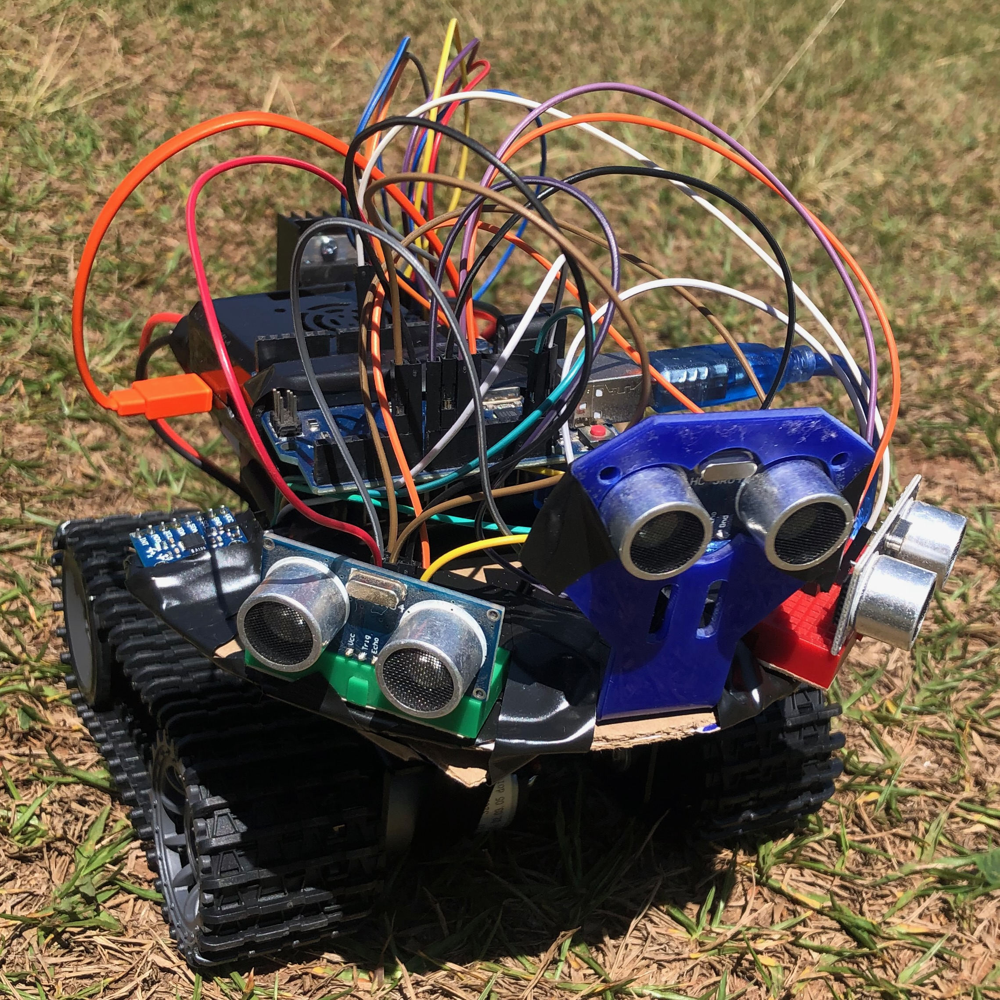
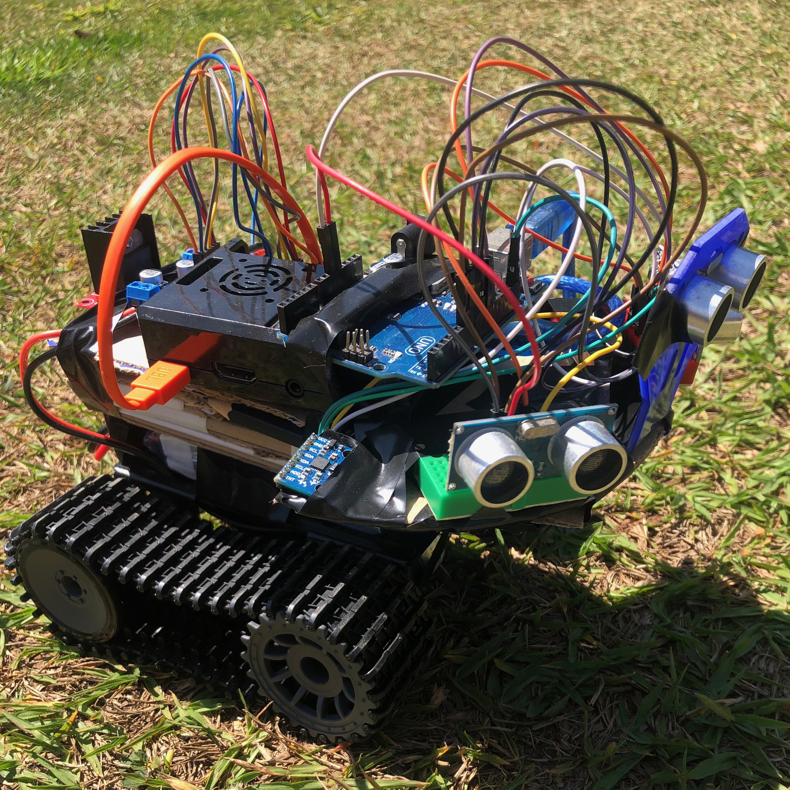

# Rover Control and Sensor Dashboard




## Table of Contents

- [Project Description](#project-description)
- [Components](#components)
- [MQTT Communication](#mqtt-communication)
- [Project Structure](#project-structure)
- [Getting Started](#getting-started)
- [Usage](#usage)
- [Contributing](#contributing)
- [License](#license)

## Project Description

The Rover Control and Sensor Dashboard project is designed to provide remote control of a rover and real-time sensor data monitoring. This project is divided into several components, including rover control, sensor data collection, and a web-based dashboard for monitoring sensor data and controlling the rover.

## Components

The project consists of the following major components:

### Arduino Programs

1. **HCSR04 & MPU6050 Sensor Program (`arduino/hcsr04&mpu6050/main`):**
   - Arduino program to interface with HCSR04 ultrasonic and MPU6050 sensors.
   - [Arduino Code](arduino/hcsr04&mpu6050/main/main.ino)

2. **Rover Program (`arduino/rover_program/main`):**
   - Arduino program for rover motor control and ultrasonic sensor interface.
   - [Arduino Code](arduino/rover_program/main/main.ino)

3. **Ultrasonic Sensor Program (`arduino/ultrasonic_sensor/main`):**
   - Arduino program for standalone ultrasonic sensor.
   - [Arduino Code](arduino/ultrasonic_sensor/main/main.ino)

### Controller

1. **Autonomous Rover Controller (`controller/autonomous`):**
   - Python script for autonomous rover control using sensor data.
   - [Python Code](controller/autonomous/app.py)

2. **Terminal Rover Controller (`controller/terminal`):**
   - Python script for rover control via the terminal.
   - [Python Code](controller/terminal/main.py)

3. **Web-Based Rover Controller (`controller/web`):**
   - Flask-based web dashboard for controlling the rover and monitoring sensor data.
   - [Python Code](controller/web/main.py)
   - [HTML Template](controller/web/templates/index.html)

### Rover Dashboard

1. **Web-Based Sensor Dashboard (`dashboard`):**
   - Flask-based web dashboard for real-time monitoring of sensor data.
   - [Python Code](dashboard/app.py)
   - [CSS Styles](dashboard/static/css/style.css)
   - [JavaScript for WebSocket](dashboard/static/js/socketio.js)
   - [HTML Template](dashboard/templates/dashboard.html)

### ESP8266 MQTT Client

1. **ESP8266 MQTT Client (`esp8266/main`):**
   - ESP8266 Arduino program for MQTT communication.
   - [Arduino Code](esp8266/main/main.ino)

### Navigation System

1. **Navigation System (`navigation_system`):**
   - Python scripts for rover navigation, mapping, and tracking.
   - [Python Code](navigation_system/app.py)

### Raspberry Pi MQTT Client

1. **Raspberry Pi MQTT Client (`rasp/main`):**
   - Python scripts for rover control, sensor data collection, and MQTT communication.
   - [Python Code](rasp/main/main.py)
   - [Motor Control](rasp/main/motor.py)
   - [MQTT Client](rasp/main/mqtt_client.py)
   - [Rover Control](rasp/main/rover.py)
   - [Rover Startup](rasp/main/start_rover.py)
   - [Sensor Data Collection](rasp/main/start_sensors.py)

## MQTT Communication

MQTT (Message Queuing Telemetry Transport) is used for communication between the components of this project. MQTT is a lightweight and efficient protocol for publishing and subscribing to messages.

### MQTT Topics

- **Controller Topic:** `/rover/controller`
   - Used to send control commands to the rover.
   - Commands include FORWARD, BACKWARD, LEFT, RIGHT, and STOP.

- **Ultrasonic Sensor Topic:** `/rover/sensors/ultrasonic`
   - Publishes ultrasonic sensor data.
   - Includes data for the left, central, and right sensors.

- **MPU6050 Sensor Topic:** `/rover/sensors/mpu6050`
   - Publishes MPU6050 sensor data.
   - Includes acceleration and gyroscope readings, as well as temperature.

## Project Structure

The project is organized into different directories and files:

```plaintext
tree
.
├── arduino
│   ├── hcsr04&mpu6050
│   │   └── main
│   │       ├── main.ino
│   │       ├── MPUSensor.cpp
│   │       ├── MPUSensor.h
│   │       ├── UltrasonicSensor.cpp
│   │       └── UltrasonicSensor.h
│   ├── rover_program
│   │   └── main
│   │       ├── main.ino
│   │       ├── motor_control.cpp
│   │       ├── motor_control.h
│   │       ├── ultrassonic.cpp
│   │       └── ultrassonic.h
│   └── ultrasonic_sensor
│       └── main
│           ├── main.ino
│           ├── UltrasonicSensor.cpp
│           └── UltrasonicSensor.h
├── controller
│   ├── autonomous
│   │   └── app.py
│   ├── terminal
│   │   └── main.py
│   └── web
│       ├── main.py
│       └── templates
│           └── index.html
├── dashboard
│   ├── app.py
│   ├── static
│   │   ├── css
│   │   │   └── style.css
│   │   └── js
│   │       └── socketio.js
│   └── templates
│       └── dashboard.html
├── docs
│   └── images
│       ├── rover_1.jpeg
│       └── rover.jpeg
├── esp8266
│   └── main
│       ├── Config.h
│       ├── main.ino
│       ├── MqttManager.cpp
│       ├── MqttManager.h
│       ├── WiFiManager.cpp
│       └── WiFiManager.h
├── LICENSE
├── navigation_system
│   ├── app.py
│   ├── map.py
│   └── tracker.py
├── rasp
│   └── main
│       ├── config.py
│       ├── main.py
│       ├── motor.py
│       ├── mqtt_client.py
│       ├── rover.py
│       ├── start_rover.py
│       └── start_sensors.py
└── README.md
```

## Getting Started

Follow these steps to get started with the project:

### Hardware Setup:

1. Assemble your rover with motors, sensors, and a Raspberry Pi.
2. Connect the hardware components according to your wiring diagram.

### Software Installation:

1. Install the required software dependencies on your Raspberry Pi, including Python libraries and MQTT broker (e.g., Mosquitto).

### Configuration:

1. Update the `config.py` file with your MQTT broker's host and port.


Certainly, here's the section from "Getting Started" onwards:

### Running the Rover

To start the rover on the Raspberry Pi, run the following command:

```bash
python3 rasp/main/main.py
```

## Usage

Once the components are running, you can access the web-based dashboard by opening a web browser and navigating to the Raspberry Pi's IP address on port 5000 (e.g., `http://<raspberry_pi_ip>:5000`).

On the dashboard, you can:

- Monitor real-time ultrasonic and MPU6050 sensor data.
- Control the rover's movement by clicking the directional buttons (Forward, Backward, Left, Right, Stop).
- Observe the rover's response to ultrasonic sensor data for obstacle avoidance.

## Contributing

If you'd like to contribute to this project, please follow these steps:

1. Fork the repository on GitHub.
2. Create a new branch for your feature or bug fix.
3. Make your changes and commit them with clear and concise messages.
4. Push your changes to your fork.
5. Create a pull request to the main repository.

## License

This project is licensed under the MIT License. See the [LICENSE](./LICENSE) file for details.
